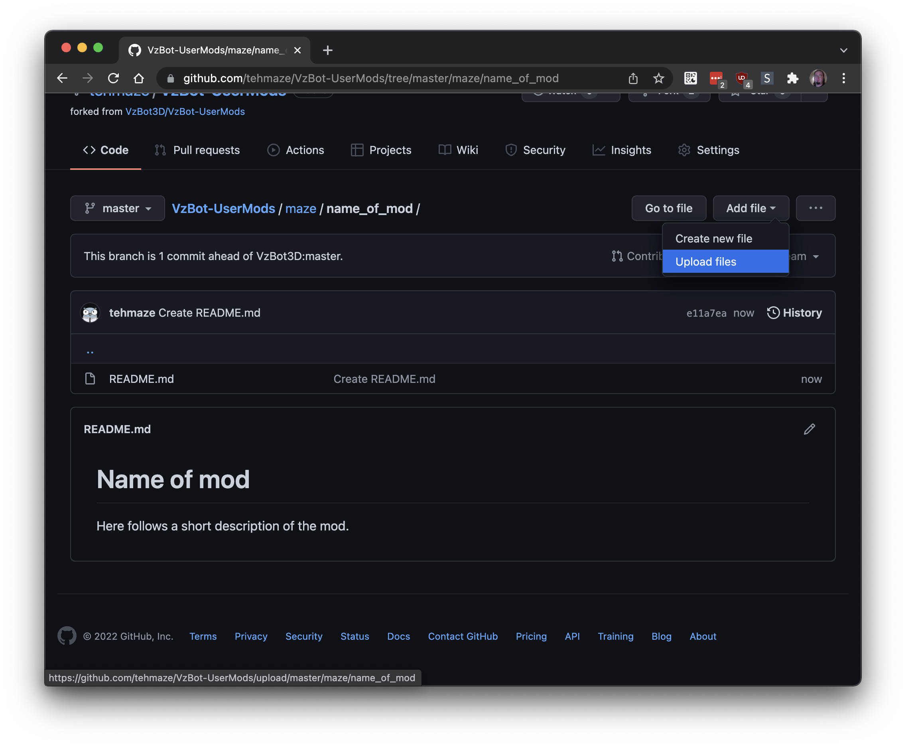

# Contributing to this repository

How to submit your mod(s):
1. Login to GitHub or [create an account](https://github.com/join)
2. Navigate to [VzBot-UserMods](https://github.com/VzBot3D/VzBot-UserMods)
3. Make a *Fork* of the repository by clicking the **Create fork** button

4. Create a new directory (make sure you are in the right repository working on your own *fork*!), GitHub automatically creates folders as you type slash `/` and setup your mod's README:

5. Upload your STLs, renders, pictures, etc:

6. Edit the top-level README:

7. Create a pull request:

8. Wait for the development team to review your contribution

