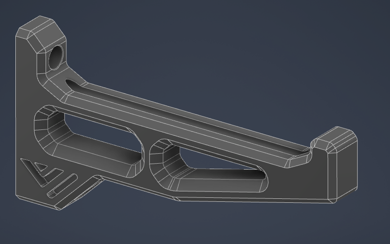

# M4 Spool Holder
This is a simple mod that allows the use of M4 screws to attach the spool holder to the frame and moves the PTFE insertion hole at the back so it cannot escape and does not have a hole on the side. A version with a front facing hole is also available.

