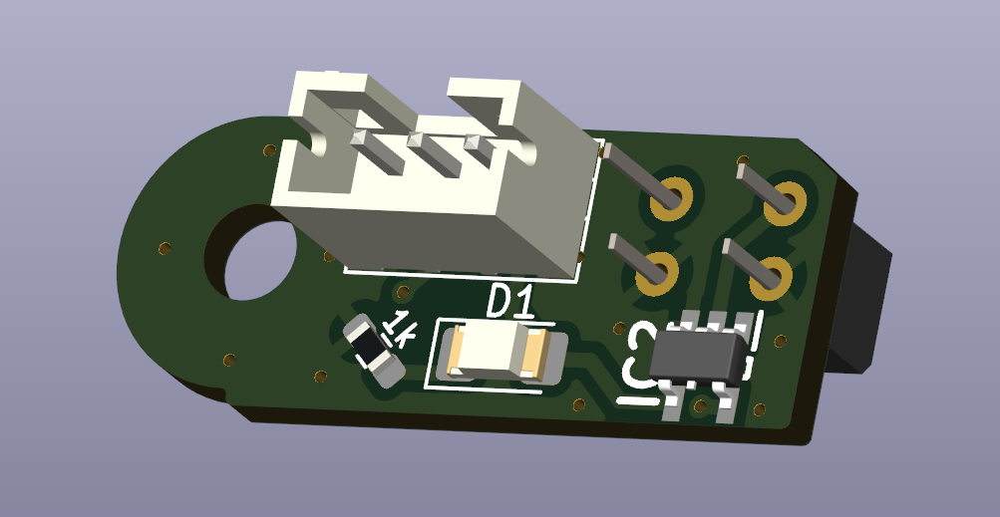
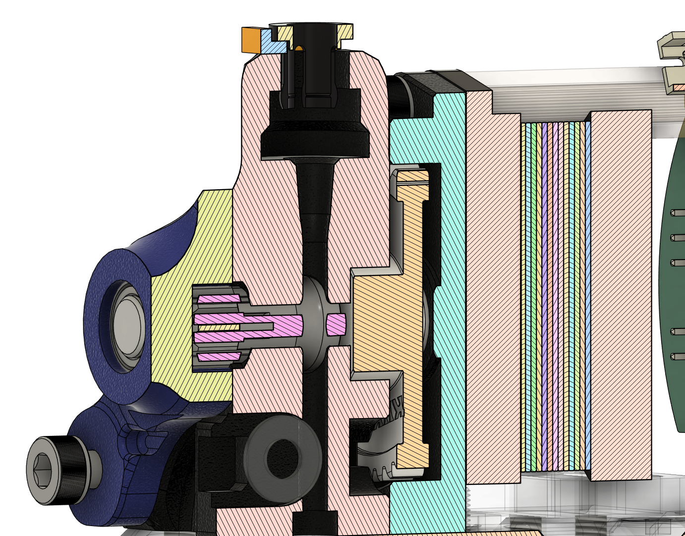
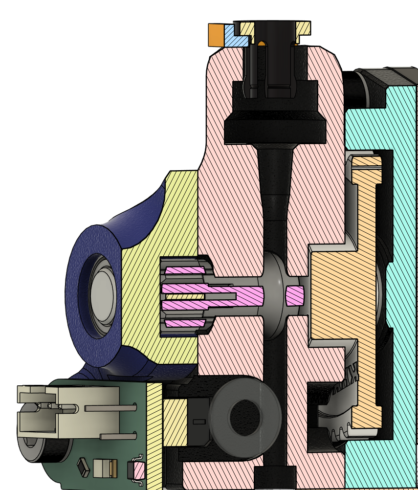

# Better filament sensor for VzHextrudORT

Based on ERCF Binky and has the same BOM.
Uses similar principle as hall effect filament sensor, but utilizes optical path blocking for triggering.

# BOM
The same as in the original Extruder **except 6x3mm magnet**

# PCB BOM
| Component | Symbol  | Footprint |
|-----------|:--------|:----------|
Capacitor 0.1µF|C2|0603
Resistor 10K|R1|0603
Resistor 1K|R2|0603
Resistor 330R|R3|0603
LED Diode|D1|1206
EE-SX1103|IC1|EESX1103
SN74LVC1G14DBVR|IC1|SOT95P280X145-5N
JST PH 3pin|J1|JST_PH_B3B-PH-K_1x03_P2.00mm_Vertical

Interactive BOM can be found in ./PCB/BOM/ibom.html

# Build
1. Order PCB from a manufacturer.
    Ones I have tested in the past: OSHPark, JLCPCB, PcbWay.

2. Solder all parts to their coresponding places (for now there is no possibility to get soldered sensors).

3. Print included STLs (You may use supports in magnet section).

4. Place 6x3mm Magnet in the printed slot.

5. Press fit sensor into the printed base.

6. Enjoy!

# PCB Images

