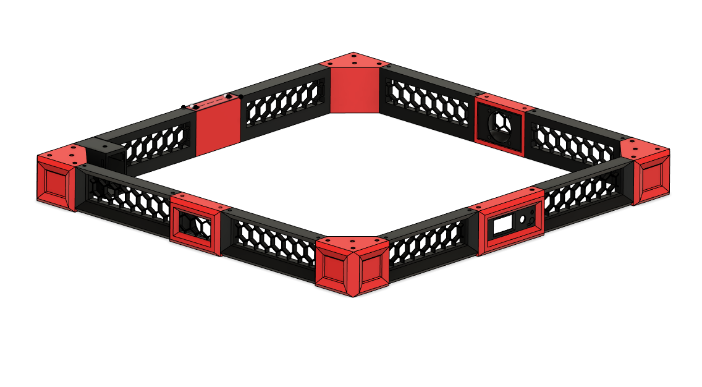

# Skirt set for the VZ330 ##  

## Features ##
55mm high skirts allows for under mounting electronics.       
Option for Integrated Voron V0 display.     
Side skirt center piece has mounts for 40mm fans. 

### BOM ### 
Note: Add extra length to acomodate for bottom pannel thickness.          
28 - M4 x 10 mm button head screws      
4 - M4 x 15mm button head screws       
4 - M3 x 6mm button head screws ( for V0 display insert )       
2 - M3 x 10mm button head screws ( for power socket)      
32 - M4 T nuts      
14 - M3 x 5mm x 4mm seat set inserts ( for fans mounts, power socket and V0 display insert )       
4 -  M2 x 8mm self tapping screws ( for mounts V0 display )       
1 - [IEC320 C14 Inlet Power Socket With Rocker Switch](https://deepfriedhero.in/products/iec320-c14-inlet-power-socket-with-red-rocker-switch)      
4 - [ Musumi C30-RK EPDM Rubber feet](https://us.misumi-ec.com/vona2/detail/110500157910) ( re-used from X5SA kit )  - will add a link when I find the correct Misumi part number )
