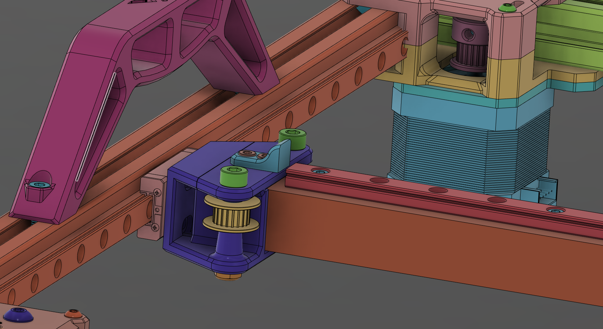
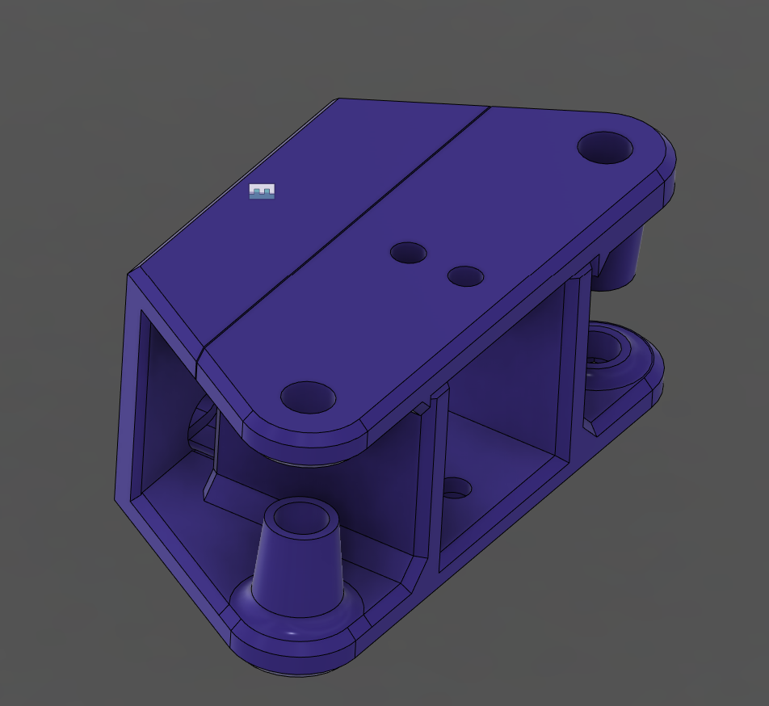

# MGN9 Mod for the gantry. (Untested)

Replaces the MGN12 on the Y axis with an MGN9 C or H. The belt is guided inside through the printed parts instead of behind them. Weight savings from MGN12H to 9C about 37+g for EACH side

Material needed:
- MGN9C or H Carriage with a 400mm long rail
- ISO7380 M3x6
- Everything else like the normal parts. 

