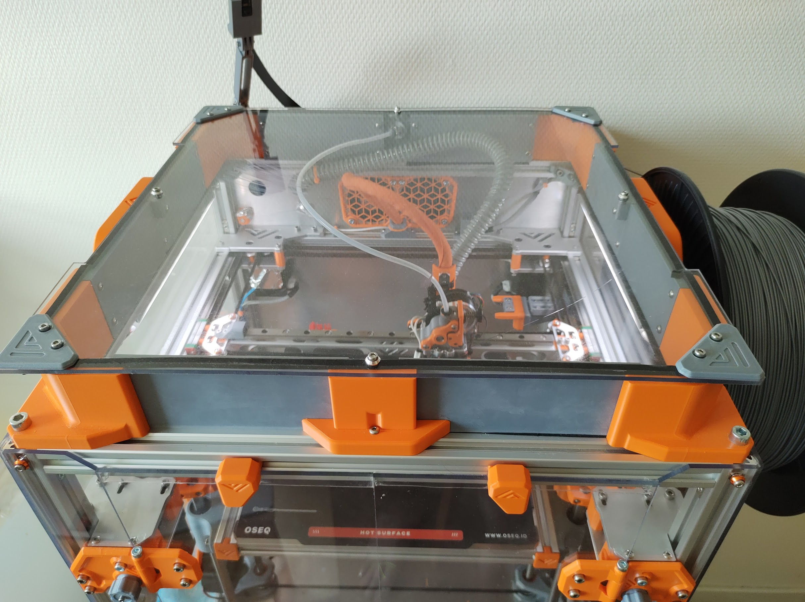

# Tophat for VZ235

Uses the vz235 stock panel. Needs heat inserts for all the holes to bolt onto. It is compatible with the handles.

You can optionally choose for the ptfe tube to go through the tophat or not.

The tophat is bolted onto the frame by using M5/M6 bolts in the tapped holes on top of your frame (so you would need to tap those if not already done). You can also use a t-nuts on the middle parts to get more grip.

