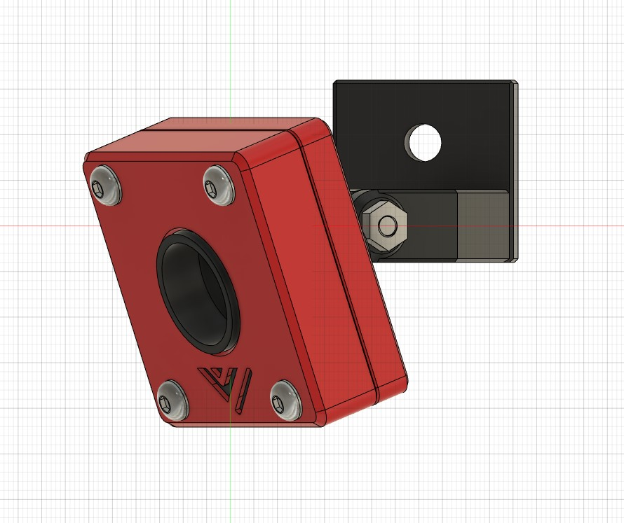
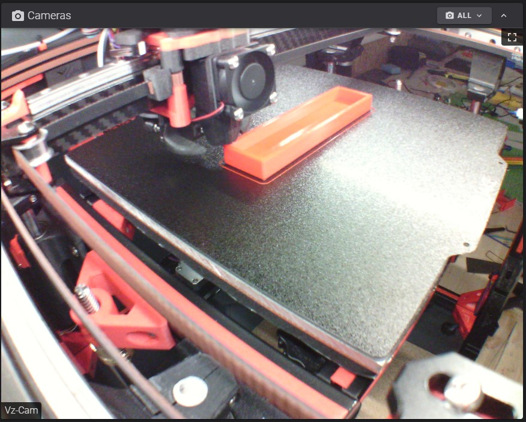
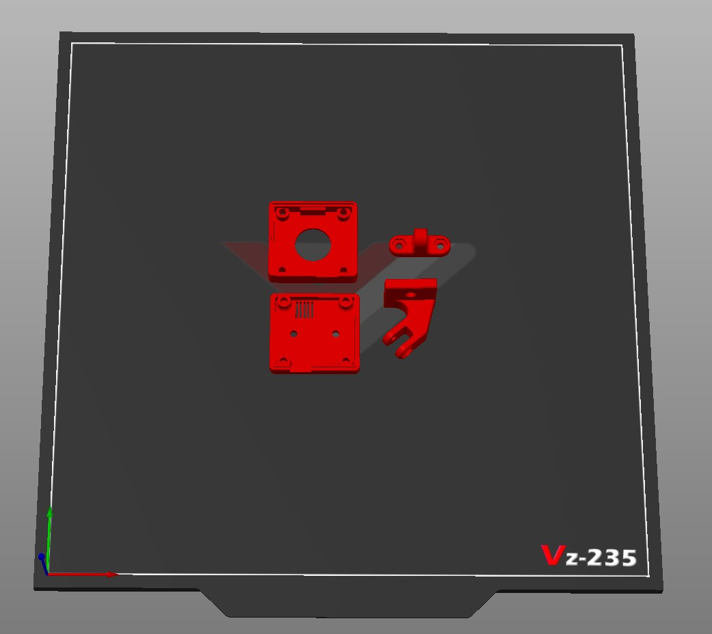

## Corner bracket mounting for a HVBCam 

The camera can be mounted in the top left corner. It is possible to lead the cable out backwards in one of the profiles. If you use the HBVCam-3M2111, you have a view angle of 110° and thus a complete overview of the print bed.

---

You need:

| amount |  | Description
| --- | --- | ---
| 5x | 12mm x M2.5 | button head screws
| 2x | 6mm x M2.5 | button head screws
| 7x | M2.5 | nuts
| 1x | M4 | 10mm screw
| 1x | xxx | slot nut

---

The camera has not the best quality, see for yourself, but it is sufficient for monitoring the printing room.

---

First screw "Bracket_Part1" to the rear half of the case. Use the M2.5x6 screws for this.
Then the lens has to be unscrewed. But this is possible without any problems. then you put the camera in the front housing shell, then put the lens back on it so that no dust gets on the sensor. Put the rear case shell on and screw both halves tight. Use the M2.5x12 screws. Screw the "Bracket_Part2" to the "Bracket_Part1" using the M2.5x12 screw.
The case should be finished. Now you can fix the camera into the top left corner of your Vz235.

---

---

This contribute was made by [der-pw](https://github.com/der-pw).  
STEP-File inside, feel free to edit, improve or modify this thing, but respect the [CC BY-SA 4.0](https://creativecommons.org/licenses/by-sa/4.0/) license.

