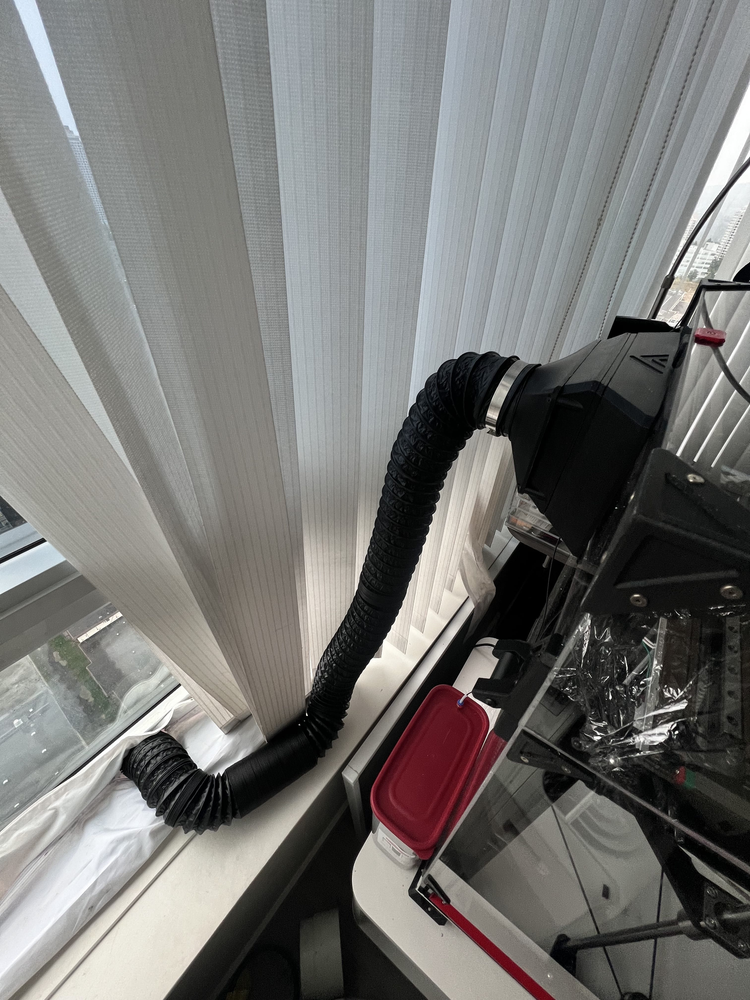

this adapter can install on the outside of the vzbot exhaust filter, to connect a 3inch vent hose.

Showcase:

BOM:

1. M3x30mm screws x 4. (vzbot offical doc use 25mm M3 here)
2. A 3 inch flexible vent hose, length based on your needs. Like this one on amazon: https://a.co/d/2pFttcT

Print with:
* 0.2mm layer height. 
* with support, 
* 15%~30% infill.
* Nice to print it in ABS, PLA also works.

If you use this hose, you can remove the hepa filter to increase the air flow. You can save some money on buying hepa filter.  

I kept the activated carbon vent filter in to prevent bugs coming.

