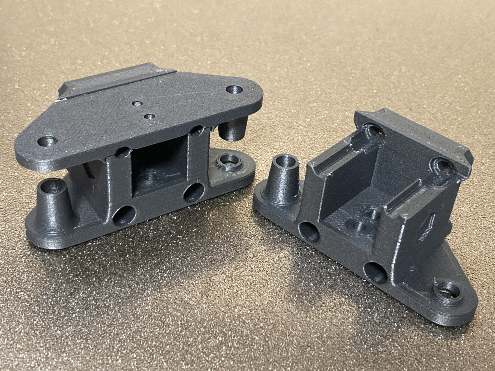
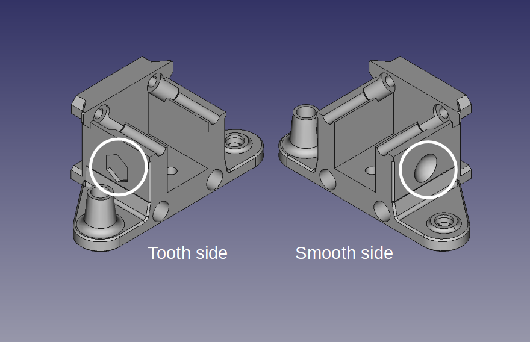

# Vz330 Y-Gantry-1515

This is the Y gantry bottom parts for the VzBoT Vz330. They are used to replace X gantry to lower cost, lighter weight 1515 size instead of 2020 size.

### examples of 1515 size rods
|Type|Weight(440mm)|Moment of inertia of area|
|---|---|---|
|A6063S−T5 square tube 15x15xt1.5|97g|0.249×104 mm4|
|Misumi HFS3-1515|150g|0.280×104 mm4|
|MakerBeamXL|147g||

The geometry and shape is based on the Vz330 V1.2's Y gantry except for minor differences and is fully compatible.

note: After the Vz330 V1.2 is released, the left and the right of the Y gantry are not common parts.  If you are using less than V1.2, please re-printing and combining Y-gantry-top-left and Y-gantry-top-right released by official VzBoT.

Side dimple marks show the direction of the part. Illustrated below are the left part, the tooth side is the front and the smooth side is the back.

## BOM

|Part|STL|PCs|
|---|---|---|
|Left Bottom|This Y_gantry_1515_bottom_left-15.0.stl|1|
|Right Bottom|This Y_gantry_1515_bottom_right-15.0.stl|1|
|Left Top|The official Vz330 V1.2's Y_gantry_top_left.stl|1|
|Right Top|The official Vz330 V1.2's Y_gantry_top_right.stl|1|
|X end stop|The official Vz330 V1.2's XendStop.stl|1|

If the fitting is tight you can use *_15.1-looser.stl instead of *_15.0.stl for fit looser.

## Tested

### Using a 1515 gantry:

I have long term tested using an aluminium 15x15xt1.5 square tube and a MGN12H for X gantry about one year and confirmed there are not really any problems for printing.

### This Y-Gantry-1515:

They are printed IEMAI CF-ABS and tested over the 3 months of 300-600mm/s high speed printings and do not show any problems.

