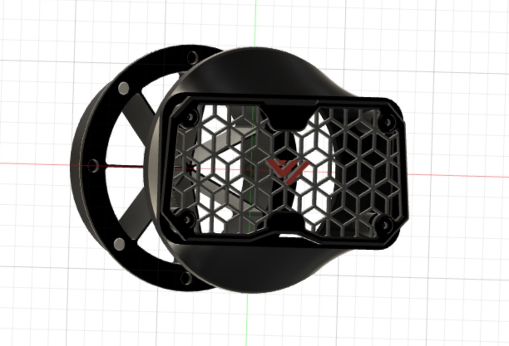
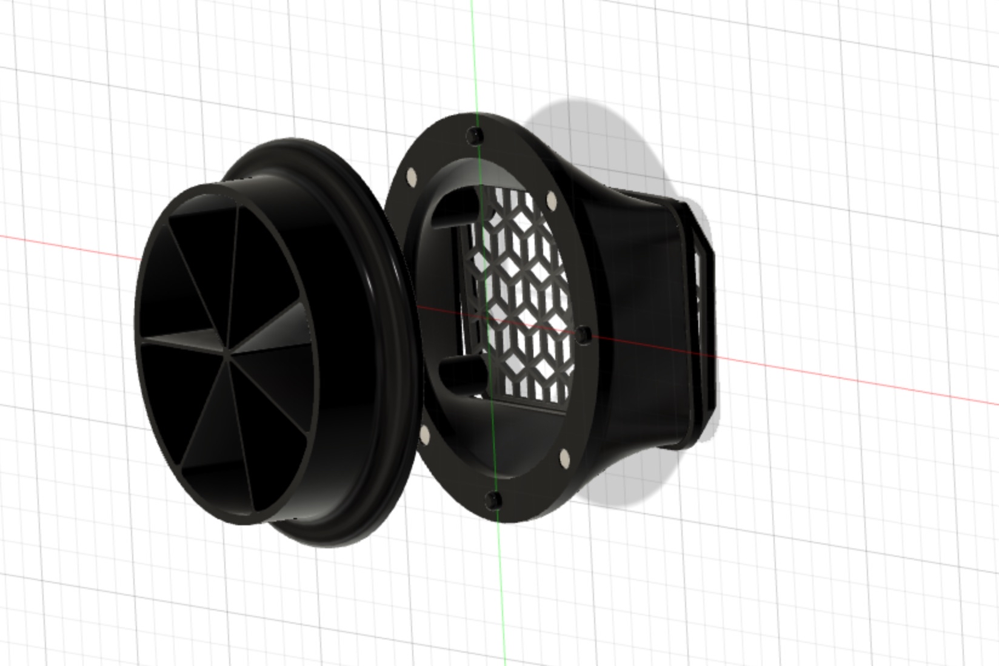

## Hot-swappable exhaust tube

This mod allows to mount a standard 100mm exhaust tube to the back of your VzBot.
It is held on via 6x3mm magnets and can easily be switched to other printers.

You also get a cap to close the exhaust when not using the tube.

### Images

### BOM

- 6x3mm Magnets x8 (+4 for cap)
- 100mm standard ventilation hose
- 100mm hose fan

### Assembly

Insert 6x3mm magnets into the 4 holes on the mount and into 4 out of the 8 holes on the hose end.
Put the hose around the hose end and tighten down with cables ties.
