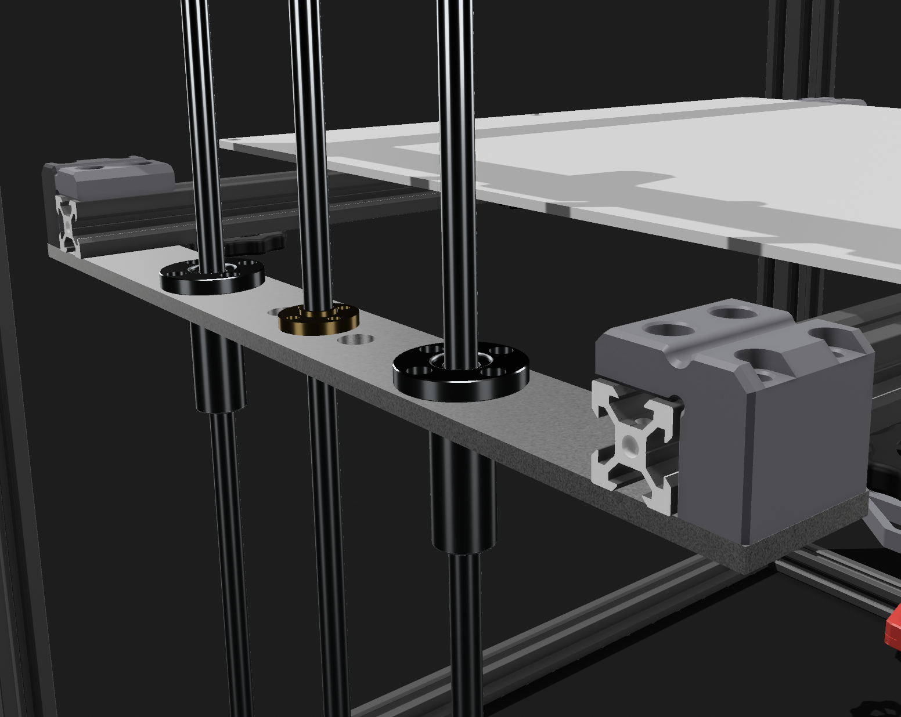
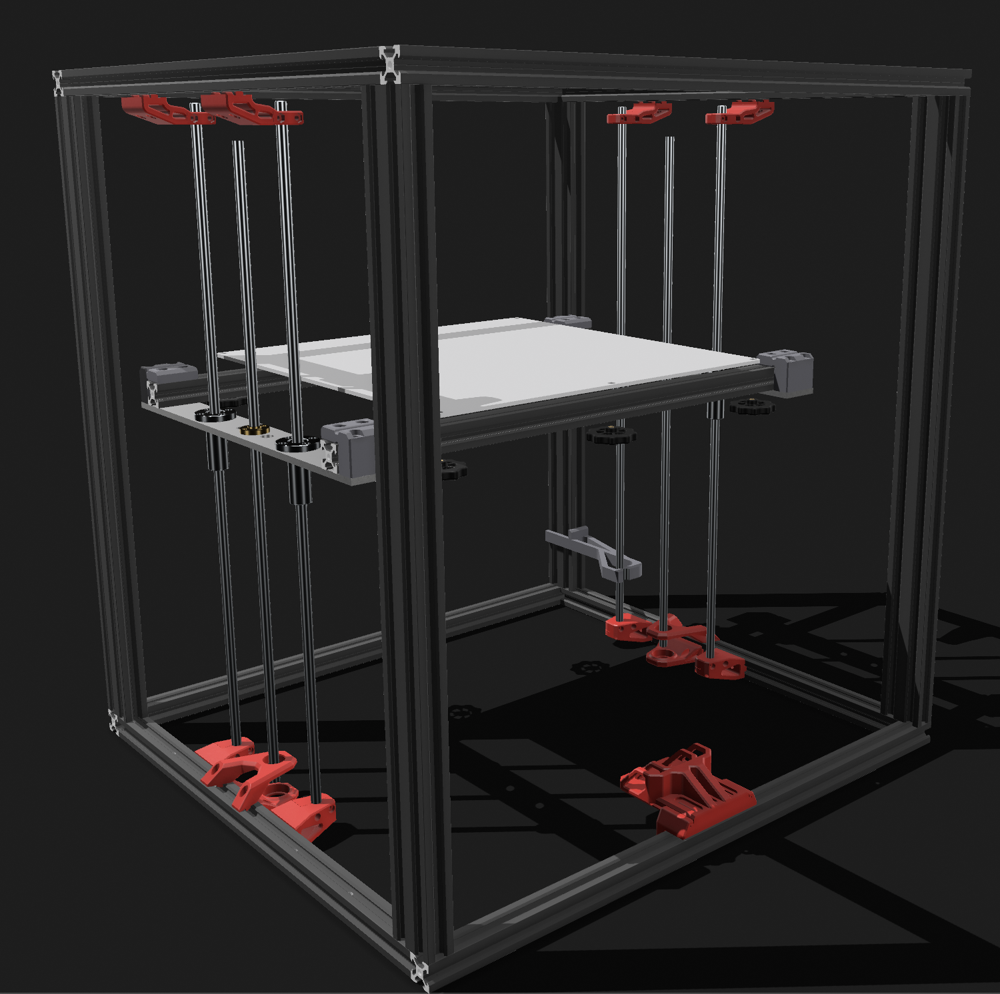
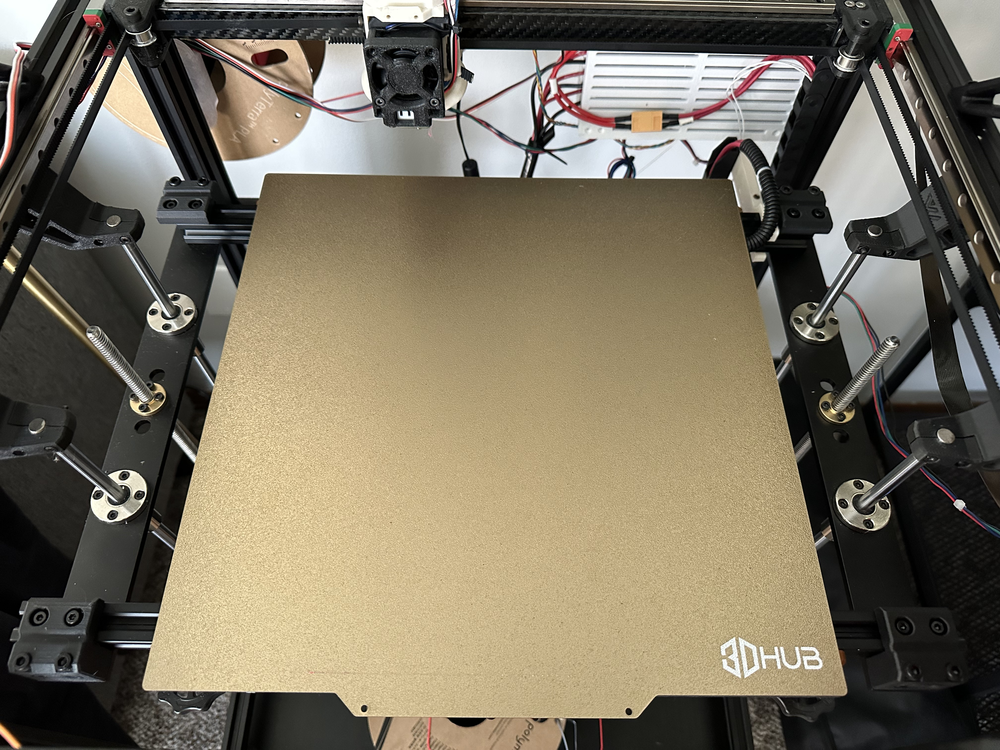

# X5SA Z
This is a mod to reuse some of the original X5SA Z components (If adapting a VZBot330 from a Tronxy X5SA).

THis reuses the original X5SA aluminum Z platforms while also utilizing the majority of thestock VzBot (printed) Z axis components.

The VzBot Z Axis components will need different spacing to align the bed with the print head and two 2020 extrusions (approx. 470mm) are used to span the gap between the two platforms. One of which can be the original X5SA Y axis extrusion if it was replaced. The attachment piece also uses (2) 4mm x 10 bolts and (2) 4mm T nuts to hold the exxtrusions and (2) 5mm x 35 bolts and (2) 5mm nuts to attach the printed part to the X5SA Z platforms, meaning 8 of each screw is required for a completed mod.

The included spacer may not work for all printer configurations as much of my printer's gantry is configured slightly differently than the stock VzBot gantry.
