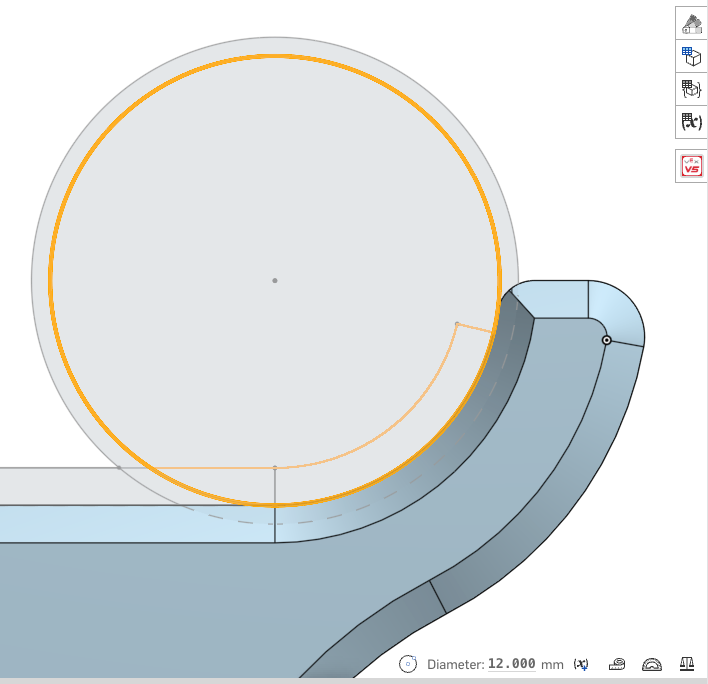

12mm Rod Aligner for [knarfie's 12mm rod mod](https://github.com/VzBoT3D/VzBoT-UserMods/tree/master/knarfie/12mm_rods)  
Drop in for the [10mm Aligner](https://github.com/VzBoT3D/VzBoT-Vz235/blob/main/Assemblies%20%26%20STL/Tools/Z%20allignment%20tool%2010mm%20rod%20VZ235%20VZ%20printhead.stl), using the same center position.

